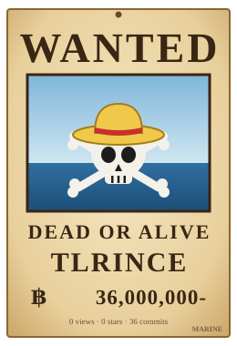

&nbsp; 秋招中...

 

### ⚓ 航海日志

- 🏴‍☠️ 我是要成为 **Offer 王** 的男人！
- 🗺️ 正在攻略的岛屿：**Java 后端 · AI Agent · RAG**
- 🚢 最近在造的船：[offer-tracker](https://github.com/tlrince/offer-tracker) · [qiuzhao-notes](https://github.com/tlrince/qiuzhao-notes) · [MyCanvasEditor](https://github.com/tlrince/MyCanvasEditor)
- 📜 航海图：[agent_java_offer](https://github.com/tlrince/agent_java_offer)，后端 / Agent / 系统设计面试复习
- 💰 右边的悬赏金每天自动更新：访问 × 50 万 + Star × 1000 万 + 提交 × 100 万

 

### 🗡️ Tech-Stacks & Tools

**Programming Languages**

**Frameworks & Middleware**

**Tools & Environment**

### 🌊 Grand Line

<picture>
  <source media="(prefers-color-scheme: dark)" srcset="https://raw.githubusercontent.com/tlrince/tlrince/output/ocean-dark.svg" />
  
</picture>
